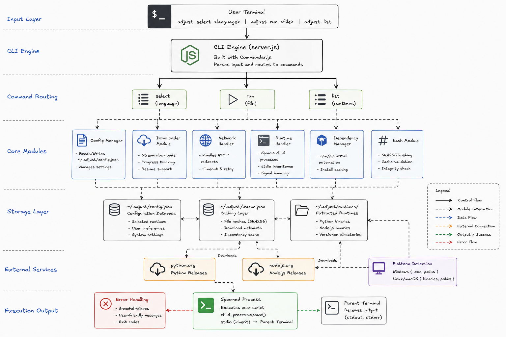

# Adjust CLI



Manage isolated Python & Node.js runtimes. Download, cache, and execute scripts without polluting your system environment.

## Usage

```bash
npm install -g adjust

# Select runtime (downloads on first use)
adjust stack python
adjust stack node

# Run a script
adjust run script.py
adjust run app.js

# Check status
adjust list
```

## How It Works

1. **Runtime Download** - Downloads Python 3.11 or Node 20 (platform-specific binaries)
2. **Dependency Caching** - SHA256-based caching skips redundant `pip install` / `npm install`
3. **Process Execution** - Spawns child process with isolated runtime, streams output to terminal
4. **Cross-Platform** - Windows/Linux/macOS with automatic platform detection

## Architecture

- `server.js` - CLI entry point (Commander.js)
- `config.js` - Persistent config & dependency cache
- `downloader.js` - Stream-based runtime download & extraction
- `networkHandler.js` - HTTP redirect handling
- `runtimeHandler.js` - Process spawning & execution
- `dependencyHandler.js` - Dependency manager (pip/npm) with SHA256 caching
- `hash.js` - File hashing for cache validation

## Key Concepts

- Node.js streams for memory-efficient downloads
- `child_process.spawn()` for process management
- SHA256 caching for dependency performance
- Cross-platform path handling
- Async/await error handling

## Setup

```bash
npm install
npm link          # Make CLI available globally
npm run dev       # Watch mode
```

## Known Issue

 `networkHandler.js` - Only handles single HTTP redirects (needs recursive chain handling)
